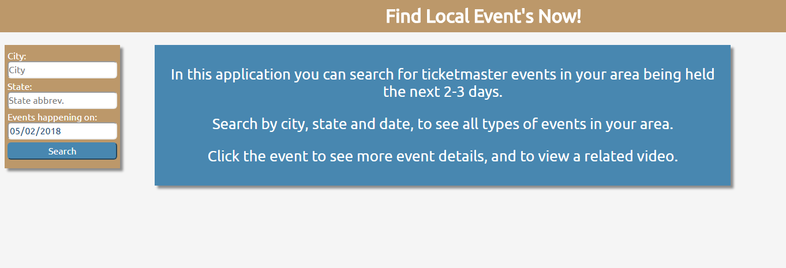
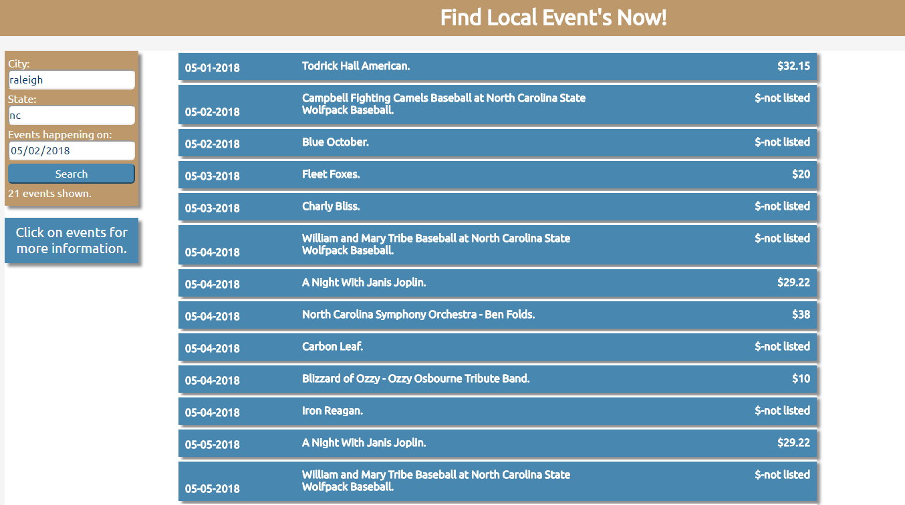
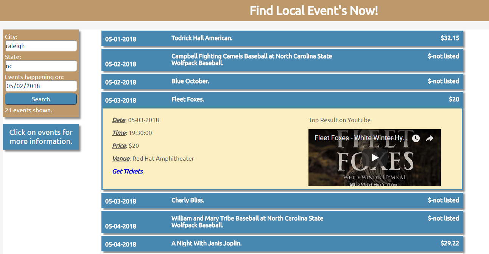

# Find Local Event's Now

# Summary

"Find Local Event's Now" is an events app that enables users to find events in their area, happening today and over the next several days.  The default the search date is the today's date.  Users can view different event options, and watch a video related to the event from inside the app.  

The goal of this app is to present users with last minute entertainment options in their area.  The search incorporates all types of events limiting to results to a specific type of event.  The video gives users a preview of what to expect right in the app.

# Live Demo

- https://gbarkin.github.io/rightpriceevents/

# Steps to find events

1.	The user will enter their city and state
2.	Review the event summaries
3.	Select an event panel to see more detail for the event
4.	Watch the event related video
5.	Click the link to the ticket master evet to purchase tickets to the event

## Screenshots
Landing Screen:

Search Results Screen:

Event Details Screen:

## Built With

JavaScript, JQuery, HTML, CSS

## Author

* **George Barkin**
